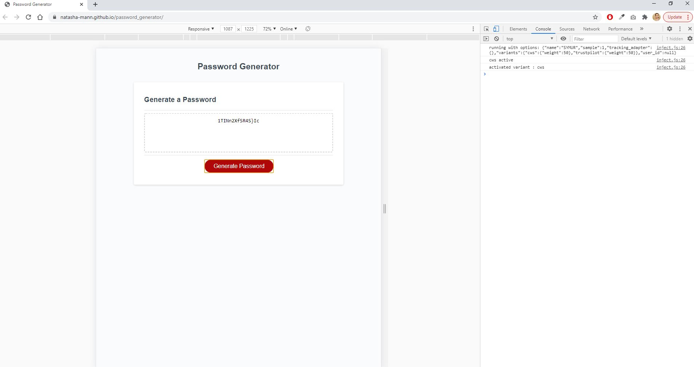

<h1>Password Generator</h1>

<h2> Table of Contents </h2>

- [Project Link](#project-link)
- [About the Project](#about-the-project)
  - [How I met the brief](#how-i-met-the-brief)
- [Screenshots](#screenshots)

## Project Link

Please click [here](https://natasha-mann.github.io/password_generator/) to see the project in action!

## About the Project

The aim of this project was to modify starter code to create an application that enables employees to generate random passwords based on criteria that they’ve selected. This app runs in the browser and features dynamically updated HTML and CSS powered by JavaScript.

### How I met the brief

- Added a user prompt for the length of the password, which is then stored as a variable.
- Added a validation to check that the password length meets pre-specified criteria (between 8 and 128 characters).
- Added user prompt to confirm which of four character types they wish to include in the password and results are stored in variables.
- Added validation to check if at least one character type has been selected.
- If either of the above validations fail, user is alerted with an error message.
- Added a function to add characters of selected arrays into a combined array.
- Added a function which takes a random character from the combined array and then loops through this for the password length and pushes the random characters into a new password array.
- Joined the password array into a string to be displayed on the user's screen.

## Screenshots

